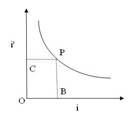

## Theory 

  
Figure 1
 

The graph connecting the angles i and i' is shown in fig(1). The bisector, meets the curve at P.  At the point P, i and i' are equal.

$$\text{OB = OC = i}$$

The angle of deviation s is given by

$$d=i+i'-A..........(1)$$

Where A is teh angle of the prism.

When  i =i' , the deviation is minimum (D).

Hence,

$$D=2i-A.........(2)$$

Therefore,

$$i=\frac{A+D}{2}.........(3)$$

The refractive index of the prism,

$$n=\frac{\sin \frac{A+D}{2}}{\sin \frac{A}{2}}...........(4)$$

$$n=\frac{\sin i}{\sin \frac{A}{2}}............(5)$$

$$i'=\frac{180-\theta_{2}}{2}$$

Where $\theta_{2}$ is difference between the reflected ray and direct ray.

### Spectrometer i-i' curve

A graph is drawn with angle of incidence i along X-axis and the angle of emergence i' along Y-axis (Figure 1). The graph is a rectangular parabola. from it, angle of incidence corresponding to minimum deviation is calculated.
